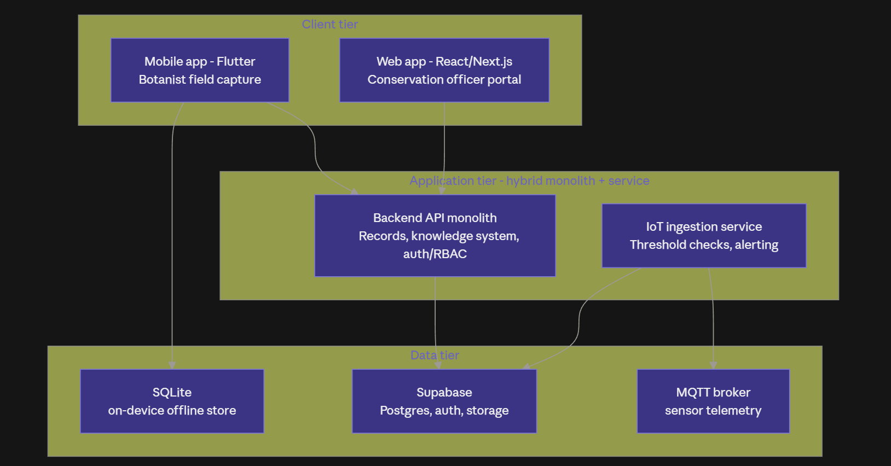
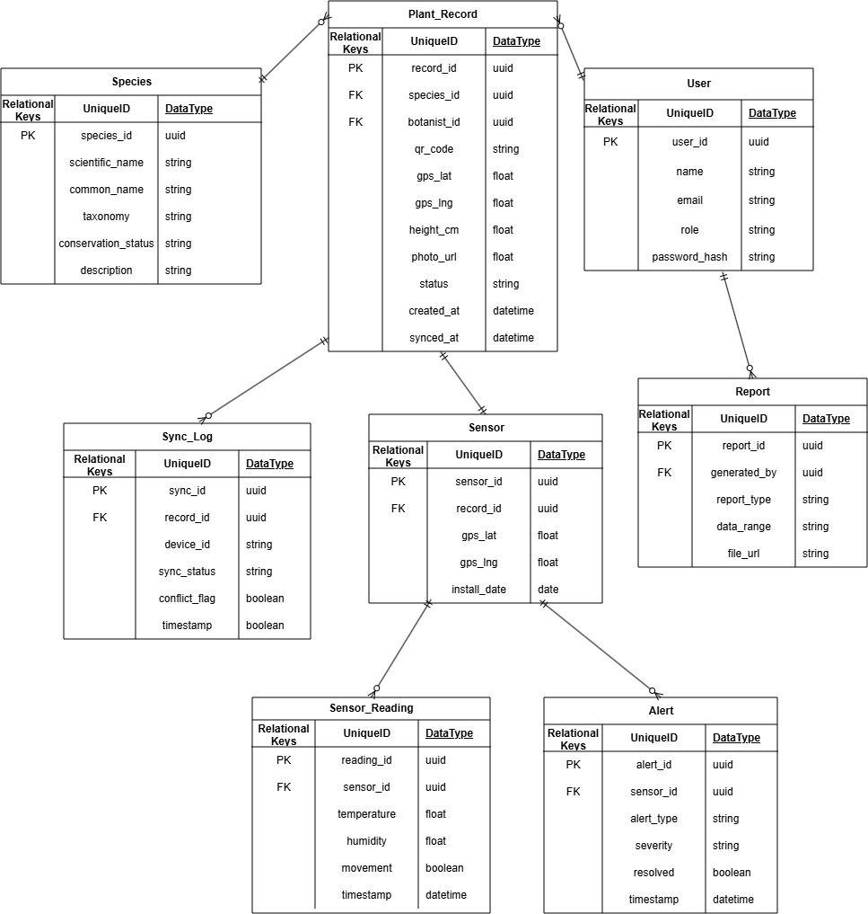
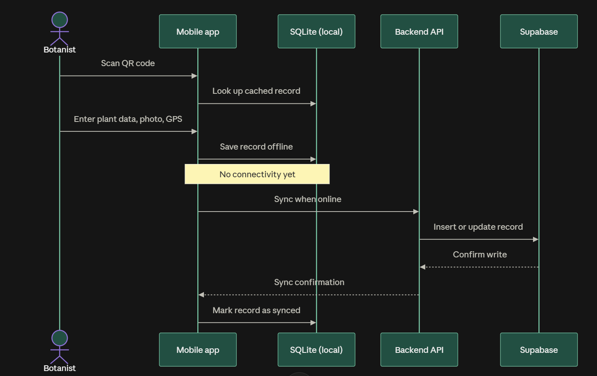
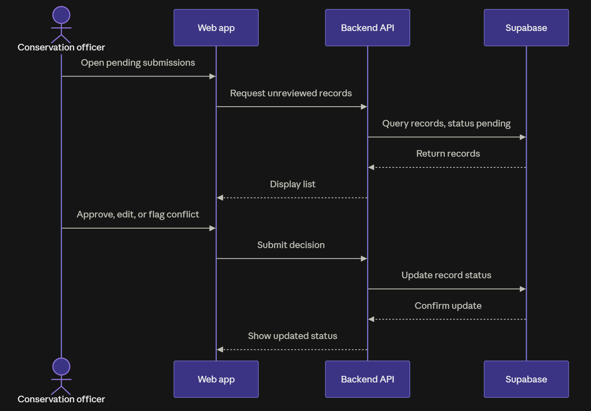
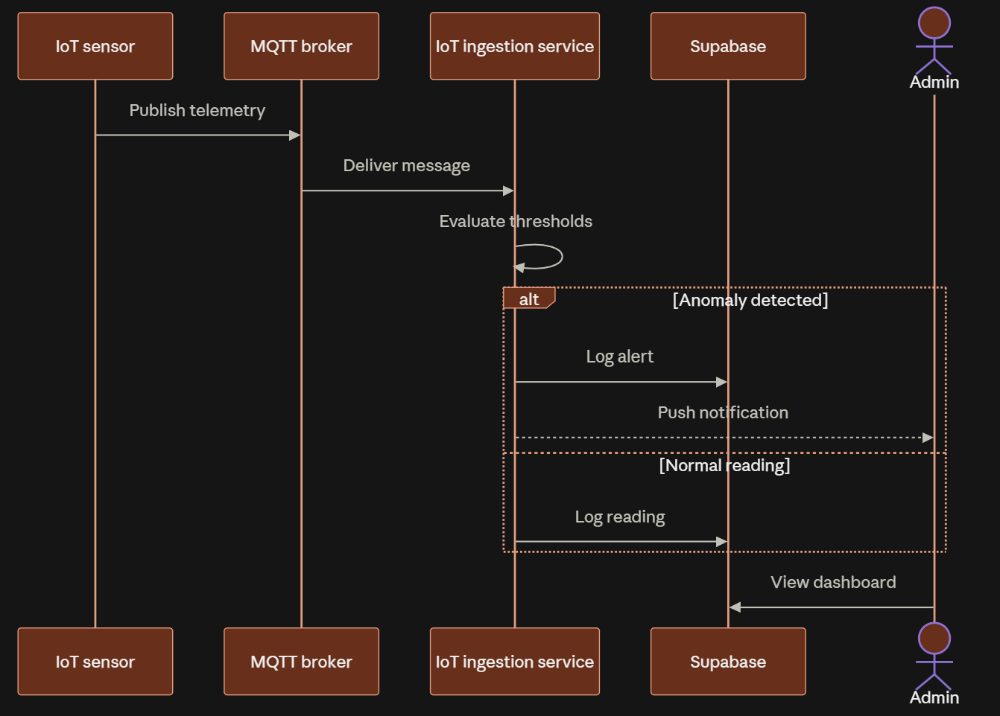

# Smart Ground-Truthing and Digital Biodiversity System

**Group 7**

| # | Name | Student ID |
|---|---|---|
| 1 | Muhammad Maqeel bin Muhammad Kahfi | 102782384 |
| 2 | Nathan Sebastian Learmonth | 102782258 |
| 3 | Badrul Aliff Aiman bin Badrulmunirzaki | 102778273 |
| 4 | Gae Jayden MWINE | 104393610 |
| 5 | Ashley Wallen | 105806559 |
| 6 | Basill Agas | 102778888 |

---

### Document Control

| Version | Date | Author | Status | Notes |
|---|---|---|---|---|
| 1.0 | 19 September 2026 | Group 7 | Draft | Initial System Proposal, submitted to the unit tutor for review |

### Executive Summary

Niah National Park, managed by the Sarawak Forestry Corporation (SFC), holds a high diversity of plant species that must be documented and monitored for conservation research and ecotourism. Today that work is largely manual: botanists record observations on paper or basic digital forms in the field and later re-enter them centrally, while conservation officers manage biodiversity knowledge across disconnected sources)Skip — introducing delay, duplicated effort, and risk of data loss, and leaving rare and endangered species with no automated protection against threats such as poaching and habitat disturbance.

This proposal is for a **Smart Ground-Truthing and Digital Biodiversity System** for NeuonAI and SFC: a QR-tagged, offline-first mobile application that lets botanists capture plant records (taxonomy, morphology, photographs, GPS) in the field with no connectivity, byte-safe syncing to a central Supabase/PostgreSQL database once back online; a web-based Digital Plant Knowledge System for conservation officers to review, approve, manage, searchable reporting and publish those records to researchers and the public; and an IoT monitoring layer with MQTT sensors and a dashboard that automatically alerts staff to unusual activity near vulnerable plant species. Security (role-based access control, encrypted sensitive data, an SSDLC-aligned OWASP ZAP vulnerability assessment) is designed in from the start.

The report analyses the background problem (Section 1.0), project scope and requirements (Section 2.0), stakeholders (Section 3.0), and compares three solution options (Section 4.0), recommending **Option C — a purpose-built hybrid system** selected in Section 5.0. The chosen solution direction, architecture, key designsabb, quality attributes, resources, and a 13-week SSDLC-aligned schedule are then detailed in Sections 6.0-8.0, with approval signatures in Section 9.0.

## Table of Contents

- [1.1 Background / Problem Description](#11-background--problem-description)
  - [1.1.1 Problem Statement](#111-problem-statement)
- [2.0 Scope](#20-scope)
  - [2.1 Goals / Aims](#21-goals--aims)
  - [2.2 Objectives](#22-objectives)
  - [2.3 Constraints and Out-of-Scope Limitations](#23-constraints-and-out-of-scope-limitations)
- [3.0 Stakeholders](#30-stakeholders)
- [4.0 Possible Solution Analysis](#40-possible-solution-analysis)
- [5.0 Deliverables and Schedule](#50-deliverables-and-schedule)
  - [5.1 Deliverables](#51-deliverables)
  - [5.2 Schedule](#52-schedule)
  - [5.3 Initial Release Schedule](#53-initial-release-schedule)
- [6.0 Solution Direction](#60-solution-direction)
  - [6.1 Tier Summary](#61-tier-summary)
  - [6.2 Key Designs](#62-key-designs)
- [7.0 Quality Management](#70-quality-management)
  - [7.1 Risk Register](#71-risk-register)
  - [7.2 Acceptance Criteria and Test Strategy](#72-acceptance-criteria-and-test-strategy)
- [8.0 Resources](#80-resources)
  - [8.1 Software / Tools](#81-software--tools)
  - [8.2 Hardware](#82-hardware)
  - [8.3 Plant Data Sources](#83-plant-data-sources)
- [9.0 Approval Signatures](#90-approval-signatures)
- [10.0 References](#100-references)
- [Appendix A: Glossary of Terms](#appendix-a-glossary-of-terms)
- [Appendix B: Offline-First Sync and Conflict Resolution Rules](#appendix-b-offline-first-sync-and-conflict-resolution-rules)
- [Appendix C: Security Testing Evidence (SSDLC)](#appendix-c-security-testing-evidence-ssdlc)

---

## 1.1 Background / Problem Description

Niah National Park, managed by Sarawak Forestry Corporation (SFC), is home to a highly diverse range of plant species that require continuous documentation and monitoring to support conservation research and ecotourism. Currently, botanists and conservation officers document these species using largely manual methods: physically tagging plants, recording observations on paper or basic digital forms, and later transferring this information into digital databases once back at the office. This process introduces delay, duplicated effort, and a high risk of information loss, especially across Niah's large and difficult-to-access forested terrain.

Beyond field documentation, researchers, conservation officers, local communities, and park visitors currently have limited access to consolidated, up-to-date biodiversity information. Species records, conservation statuses, and distribution data exist in scattered formats rather than a searchable central knowledge base, which weakens both scientific research and public conservation awareness. At the same time, rare and endangered plant species in the park remain vulnerable to threats such as poaching and habitat disturbance, with no automated system in place to detect and alert staff to unusual activity near these species.

In this project, Team Group 7 will build a smart ground-truthing and digital biodiversity system that streamlines field data collection, centralises biodiversity knowledge, and adds IoT-based monitoring for the park's most vulnerable plant species.

### 1.1.1 Problem Statement

Botanists currently have no integrated way to scan, record, and geotag plant species while working offline in the field, and conservation officers have no centralised system to review, manage, and publish that data for researchers and the public. There is also no automated way to protect rare and endangered plant species from threats such as poaching or habitat disturbance while staff are not physically present.

By considering the background of the project along with the list of issues and pain points that need to be solved, the team proposes an integrated system that lets botanists scan QR-tagged plants and record species data offline in the field, lets conservation officers manage and publish that data through a centralised digital knowledge system, and adds IoT-based sensors to automatically monitor and alert staff to threats near vulnerable plant species — solving both the field-documentation problem and the biodiversity-protection problem described above.

---

## 2.0 Scope

This project will provide Niah National Park with an integrated web-based and mobile biodiversity documentation infrastructure. Conservation officials will use a web-based knowledge system to manage, assess, and disseminate the species data that botanists scan from QR-tagged plants, record offline in the field, and sync to a central database. To aid in the protection of rare and endangered plant species, the platform also has an IoT-based monitoring layer and role-based security controls.

### 2.1 Goals/Aims

This system will help Sarawak Forestry Corporation modernise how plant species are documented, managed, and protected in Niah National Park, replacing manual paper-based fieldwork and disconnected knowledge sources with an integrated digital platform.

The system will let botanists scan QR-tagged plants and record species information — including taxonomy, morphology, photographs, and GPS location — directly on a mobile device, even without internet connectivity, syncing to the central database once connectivity is restored. Conservation officers will use a web-based knowledge system to review, approve, manage, and publish this data, making accurate biodiversity information available to researchers and park staff. To protect the park's most vulnerable plant species, IoT sensors will continuously monitor environmental conditions and detect unusual activity near tagged locations, alerting administrators in real time. Together, these components are intended to remove the delay, duplication, and data loss inherent in the current manual process while adding a layer of automated protection that did not exist before.

### 2.2 Objectives

Having a general idea of what to build is not sufficient to ensure the project develops smoothly; the project also needs specific, measurable objectives that define when each feature can be considered complete.

- Botanists shall be able to scan a QR-tagged plant and have its associated record load on the mobile device in under 5 seconds, even without internet connectivity.
- The mobile app shall allow a botanist to fully register a new plant record (taxonomy, morphology, height, photographs, GPS location) offline, storing it locally until sync is possible.
- Once connectivity is restored, the mobile app shall automatically sync all offline-recorded plant data to the central database with zero silent data loss, resolving conflicting edits where they occur.
- The system shall automatically generate a unique QR code for every new plant record, linking directly to that record's stored details.
- Conservation officers shall be able to add, edit, delete, review, and approve plant species records through the web-based Digital Plant Knowledge System.
- The web system shall support searching and filtering species records by scientific name, common name, or conservation status.
- Conservation officers shall be able to generate and export biodiversity reports from the system, covering species records and field survey activity.
- The system shall enforce role-based access control so botanists, conservation officers, and admins can only access the functions relevant to their role.
- All personal data, plant records, and assessments shall be encrypted, and the application shall pass a defined vulnerability assessment with all critical/high findings remediated and re-verified before submission.
- IoT sensors shall collect real-time environmental and location data (temperature, humidity, movement) near tagged rare/endangered plant species and shall trigger an automated alert to the administrator dashboard when unusual activity is detected.
- Administrators shall be able to monitor sensor data and alerts through a centralised IoT dashboard, with historical data stored for long-term habitat condition analysis.

| Functional area | Key requirement |
|---|---|
| Mobile field app | Offline-first plant record capture (QR, GPS, camera). Tagged plants are identified by scanning a stable QR record ID. |
| Web knowledge system | Species records management, review/approval, search and reporting for conservation officers. |
| Offline-to-cloud sync | Local SQLite store on the device; stable record ID resolves against the central database once connectivity returns; conflicts resolved to a defined strategy. |
| IoT monitoring | Sensors collect temperature, humidity, and movement near tagged rare/endangered species; automated alerts raised for unusual activity. |
| Security & privacy | Role-based access control; encrypted personal, plant, and assessment data; SSDLC-aligned vulnerability assessment and remediation. |

### 2.3 Constraints and Out-of-Scope Limitations

#### Constraints

- GPS accuracy may be reduced under Niah National Park's dense forest canopy, which can affect the precision of recorded plant locations; this is a known environmental limitation rather than a system defect.
- IoT hardware for real-time environmental sensing may not be available for testing within the unit timeline; sensor data may need to be simulated, with this assumption clearly flagged in the final report.
- Offline-first mobile sync must handle cases where multiple botanists edit the same record before reconnecting; the conflict-resolution strategy chosen will directly limit how complex simultaneous field edits can be.
- The unit timeline (a single trimester) limits the depth of testing possible for the vulnerability assessment and remediation cycle compared to a production deployment.

#### Out-of-Scope Features

- Public-facing visitor mobile app or QR-based educational content for ecotourism (the mobile app in this project is scoped to the Botanist role only).
- Facial or biometric recognition of park staff or visitors.
- Automated species identification from photographs using machine learning/AI.
- Integration with third-party government biodiversity databases outside SFC's own system.
- Physical deployment and long-term maintenance of IoT hardware in the field beyond the prototype/demo stage.
- (Optional) The innovative ground-truthing workflow (Objective 5) is out of scope unless the team confirms with the supervisor that pursuing it is required or beneficial for full marks.

| Type | Constraint / limitation | Implication for the project |
|---|---|---|
| Environmental | GPS accuracy reduced under dense forest canopy | Recorded plant locations are approximate; known limitation, not a defect |
| Hardware | IoT sensors may not be available for field testing in time | Sensor data may be simulated; assumption clearly flagged in the final report |
| Data integrity | Multiple botanists may edit the same record offline | Conflict-resolution strategy bounds how complex simultaneous edits can be |
| Timeline | Single trimester for vulnerability assessment and remediation | Depth of testing is limited versus production deployment |
| Out of scope | Public ecotourism app, ML/AI species identification, external government DB integration, physical IoT deployment | Not delivered; referenced only for context |

---

## 3.0 Stakeholders

| Stakeholder | Role | Interest |
|---|---|---|
| Sarawak Forestry Corporation (SFC) | Client / business owner | Faster, more accurate biodiversity records for Niah National Park; reduced lag between field observation and usable data; better tools for conservation decision-making. |
| NeuonAI | Industry partner / commercialisation partner | A validated system it can eventually commercialise; provides domain guidance on ground-truthing workflow and data standards. |
| Swinburne University of Technology Sarawak (COS30049) | Academic sponsor | The project meets unit learning outcomes and engineering rigor (SSDLC, testing, documentation); the tutor acts as sponsor on the client's behalf. |
| Botanists / field officers | End user (mobile app) | A fast, reliable, offline-capable way to record field data without duplicating paper-then-digital work. |
| Conservation officers | End user (web app) | Accurate, searchable species records; ability to review/approve field submissions; reports for management and funding decisions. |
| Park visitors & local communities | Secondary/indirect user | Access to QR-enabled educational content, supporting ecotourism and biodiversity awareness. |
| Project team (COS30049 Group 7) | Developers/providers | Deliver a working system meeting both the client brief and unit assessment requirements within the trimester. |

---

## 4.0 Possible Solution Analysis

Before deciding on our final approach, we looked at three different ways to solve SFC's biodiversity documentation problem.

- **Option A: Just digitize the paper records** — Keep the current manual process (paper forms, physical tags) but type the data into a spreadsheet or basic database afterward.
- **Option B: Use an existing tool instead of building our own** — Tools like ArcGIS Field Maps, Survey123, or iNaturalist already exist for field data collection. We could try to configure one of these to fit SFC's needs instead of building custom software.
- **Option C: Build our own system (mobile app + web app + IoT), tailored to SFC** — Design and build a system from scratch that matches exactly how SFC's botanists and conservation officers actually work such as QR tagging, offline recording, GPS, and sensor-based monitoring for endangered plants.

| What matters | A: Just digitize | B: Use existing tool | C: Build our own |
|---|---|---|---|
| Works offline in the forest | No — still relies on manual work first | Sort of — decent tools usually cost extra for this | Yes — we design it offline-first from day one |
| Matches SFC's QR-tagging workflow | No | Not really — would need a workaround | Yes — built exactly for it |
| Who owns the data/system | Nobody really "owns" a structured system | The tool vendor does, not SFC or NeuonAI | SFC and NeuonAI fully own it |
| Can add IoT sensors for poaching/threats | No | Rarely supported | Yes, we design it in |
| Meets the security requirements (SSDLC, roles) | Not applicable | Depends entirely on the vendor | Fully in our control |
| Cost | Cheapest | Ongoing subscription fees | No license fees, just our time |
| Can we build it in one trimester? | N/A, nothing to build | Fast to set up but shallow | Doable — we already have a 13-week plan for it |

**Why we picked Option C:**

Option A doesn't actually fix the problem. Its slow, error-prone manual process is still there — we'd just be typing it up later. Option B is quicker to set up, but most ready-made tools don't handle QR-based tagging the way SFC needs, and using someone else's platform means NeuonAI wouldn't end up with their own product to sell or grow — which matters since they're a commercialisation partner, not just a client. Option C takes more work, but it's the only one that actually solves the offline, security, and IoT requirements SFC asked for, and gives NeuonAI something real they can build on afterward (similar to their existing RoadPlus product).

---

## 5.0 Deliverables and Schedule

### 5.1 Deliverables

- Project proposal document
- System design document (ER diagram, architecture diagram, UI/UX wireframes)
- Source code: mobile ground-truthing app, web knowledge system, backend API, IoT simulation & dashboard
- Working prototype covering all four mandatory areas
- Security documentation: SSDLC plan, vulnerability assessment report, remediation log, re-assessment report
- Test documentation: test plan, unit/integration test cases and results
- User manual (botanist mobile guide + conservation officer web guide)
- Final report and presentation slides, with live demo
- (Optional) Innovative ground-truthing workflow write-up and evaluation

### 5.2 Schedule

| Phase | Weeks | Deliverable |
|---|---|---|
| Proposal & Requirements | 1–4 | Project proposal document |
| System Design | 5–6 | Design document + wireframes |
| Core Backend & Database | 7–8 | Working API + DB |
| Mobile Ground-Truthing App | 8–9 | Functional mobile app |
| Web Knowledge System | 8–9 | Functional web portal |
| IoT Module | 10 | Working IoT dashboard |
| Security Testing | 11 | Security assessment report |
| Integration & Testing | 12 | Stable full system |
| Final Documentation & Demo | 13 | Final report + demo + Presentation |

### 5.3 Initial Release Schedule

| No. | Item | Dependencies | Business Value (1 least - 10 most) | Release Schedule (Sprint #) |
|---|---|---|---|---|
| 1 | Set up Supabase project (PostgreSQL schema, auth, RBAC, storage) | — | 10 | Sprint #1 |
| 2 | Deliver mobile offline-first field app: record capture (QR, GPS, camera) | 1 | 9 | Sprint #1 |
| 3 | Deliver web knowledge system: species record CRUD + search | 1 | 9 | Sprint #1 |
| 4 | Implement offline-to-cloud sync (SQLite → Supabase) with defined conflict strategy | 2 | 8 | Sprint #1 |
| 5 | Add conservation officer review/approval workflow and searchable reporting | 3 | 8 | Sprint #2 |
| 6 | Add IoT sensor ingestion, monitoring dashboard and automated alerts | 3 | 7 | Sprint #2 |
| 7 | Complete security: vulnerability scan, remediation, re-verify before submission | 6 | 8 | Sprint #2 |
| 8 | Final integration, system testing, documentation and demo | 1-7 | 7 | Sprint #2 |

---

## 6.0 Solution Direction

The chosen direction is **Option C** from Section 4.0: a purpose-built system, using a **hybrid architecture**. A single backend monolith handles records, the knowledge system, and authentication and role-based access control, while the IoT data pipeline runs as its own lightweight service, since sensor telemetry is naturally event-driven (arriving continuously over MQTT) rather than request-response like the rest of the system. This was chosen over a full microservices split, which would add service discovery, inter-service authentication, and separate deployments that a 5 to 7 person student team cannot reliably manage across a 13-week trimester, and over a single undivided monolith, which would awkwardly force a streaming data source through a request-response API pattern.

   
  <em>Figure 1: Plantiful system architecture — client, application, and data tiers</em>

The tiers, components, and their interactions are captured in Figure 1, and the underlying data model is shown in Figure 2.

   
  <em>Figure 2: Plantiful data model (ER diagram)</em>

### 6.1 Tier Summary

| Tier | Components | Responsibility |
|---|---|---|
| Client tier | Mobile app, Web app | Field data capture by botanists (offline-capable); species management, review, and reporting by conservation officers |
| Application tier | Backend API monolith; IoT ingestion service | Business logic, authentication and RBAC, record CRUD, sync handling; sensor telemetry ingestion and alert evaluation |
| Data tier | Supabase (Postgres, auth, storage); SQLite (on-device); MQTT broker | Central source of truth and file storage; offline buffer on the mobile device; transport for sensor telemetry |

### 6.2 Key Designs

- **Mobile framework:** React Native, chosen so the whole team works in one language (TypeScript) across both the field app and the web knowledge system. A single language lets us share the QR/GPS/camera handling logic, and means every team member can contribute to either app instead of splitting into Dart and TypeScript camps. The mobile app still gets its offline-first local SQLite store, QR scanning, GPS and camera as required. (Flutter was the alternative, discarded for the language split and smaller plugin alignment with the chosen web stack)
- **QR strategy:** each QR code encodes only a stable record ID, resolved against Supabase when online or a local synced cache when offline, so records can be corrected centrally without reprinting physical tags.
- **Sync conflict resolution:** implemented in stages, last-write-wins first to establish a working sync pipeline, then a manual conflict queue routed to the conservation officer's web dashboard as an enhancement if time allows, falling back to last-write-wins alone if week 12 arrives before the queue is built.
- **Central and offline database split:** Supabase (managed Postgres with an auto-generated REST API, authentication, row-level security, and file storage) as the central database, paired with SQLite on the mobile device as the offline-first local store; REST is the transport connecting SQLite to Supabase once connectivity returns, and is also how the web app and IoT service communicate with Supabase.
- **IoT approach:** simulated sensors publishing over MQTT to a fixed topic and payload contract first, so the full pipeline (broker, ingestion service, database, dashboard, alerting) can be built and tested end to end; real ESP32 hardware publishing to the same topic and schema can then be swapped in or added alongside the simulator without changing any downstream component.
- **Security approach:** threat modelling and secure design decisions made during the Section 6 design stage (this section), verified with an OWASP ZAP scan, remediation, and re-assessment pass in Week 11, in line with the Secure Software Development Lifecycle.

#### The three core workflows

   
  <em>Figure 3: Botanist field capture flow — offline capture, QR, sync, review</em>

   
  <em>Figure 4: Conservation officer review and approval flow</em>

   
  <em>Figure 5: Admin system administration flow</em>

---

## 7.0 Quality Management

Quality is defined as five dimensions that ideas from SFC, NeuonAI and the end users of the system. Here are different types of quality management in the context of this project:

- **Functional quality** — the platform performs with the core workflow correctly such as QR scanning, field data capture with offline mode, synchronisation to the central database and review or approved by conversation officers without data loss or corruption at any stage.
- **Data quality** — record species and entered the system that are accurate, complete and consistent record without any duplicate entries and no missing mandatory fields.
- **Security quality** — role-based access controls correctly restrict that can create edit or approve records. The system meets the standards set out in SSDLC plan.
- **Usability** — botanists or field officers can access with limited connectivity, gloves or bright outdoor light can operate the mobile app with minimal training beyond the provided user manual.
- **Reliability** — the offline-first architecture behaves as intended under real field conditions with sync operations that either succeed completely or fail safely.

Using SMART (Specific, Measurable, Achievable, Relevant, Time-bound) can keep dimensions measurable rather than aspirational.

| Quality Attribute | Metric | Target | How Measured |
|---|---|---|---|
| Reliability (Offline sync) | Sync success rate | More than 95% of test submissions sync without data loss after reconnecting | Field/offline simulation testing (Week 12, Integration & Testing phase) |
| Functional performance | QR scan to record time | Less than 5 seconds average per second | Mobile app performance testing |
| Security | Critical/high vulnerabilities after remediation | 0 remaining | OWASP ZAP re-assessment report (Week 11 per SSDLC deliverable) |
| Code quality | Test coverage on backend API and mobile sync module | More than 80% | Unit or integration test suite results |
| Usability | Task complete rate (unassisted) | More than 90% across 5-user field-officer walkthrough | Moderated usability test using the draft user manual |
| Data integrity | Mandatory field enforcement | 100% of required fields validated before sync | Backend validation testing |

### 7.1 Risk Register

| # | Risk | Likelihood | Impact | Mitigation | Owner |
|---|---|---|---|---|---|
| R1 | Data loss during offline-to-cloud sync | Medium | High | Byte-safe sync validation, conflict-resolution strategy, retry with last-write-wins fallback | Mobile App (Sync & Backend APIs) |
| R2 | IoT hardware unavailable within the trimester | Medium | Medium | Use simulated sensors over MQTT with an identical topic/payload contract so real ESP32 devices can be swapped in without downstream change | Integration, PM & Documentation |
| R3 | Poor or no connectivity in the field | High | Medium | Offline-first SQLite store with automatic background sync once connectivity returns | Mobile App (Field Data Capture) |
| R4 | Security vulnerabilities discovered late in the cycle | Medium | High | SSDLC-aligned OWASP ZAP scan in Week 11 with remediation and re-assessment before submission | Team lead / Security owner |
| R5 | Scope creep against the 13-week timeline | Medium | Medium | Prioritised Initial Release Schedule (Sprint #1/#2) with out-of-scope features tracked and re-baselined | Team lead |
| R6 | Duplicate or inconsistent species records | Medium | Medium | Unique QR record ID, mandatory-field validation, and the review/approval workflow | Web Knowledge System (Records) |

### 7.2 Acceptance Criteria and Test Strategy

The system is accepted only when it meets the measurable targets in the Section 7.0 quality matrix. Verification is layered across Weeks 11-13:

- **Acceptance criteria** — every requirement maps to a measurable target in the quality matrix; a criterion passes only if its metric is achieved in the verification run.
- **Test strategy** — unit tests (backend API, mobile sync module), integration tests (offline sync to Supabase, MQTT ingestion), and system acceptance tests (offline-to-online sync round-trip, QR scan to record, role-based access control checks).
- **Verification evidence** — OWASP ZAP report with remediation log and re-assessment (Week 11), integration results and sync-success-rate simulation report (Week 12), and usability walkthrough results (Week 13).

---

## 8.0 Resources

### 8.1 Software / Tools

| What it's for | Tool | Why |
|---|---|---|
| Mobile app | React Native | One TypeScript codebase for the offline field app (camera, GPS, QR scanning) |
| Web app | React / Next.js + Tailwind | The knowledge system conservation officers use |
| Database & backend | Supabase (PostgreSQL) | Central database, auto-generates our APIs, handles login/security, stores files |
| Offline storage | SQLite | Stores data on the phone before it syncs |
| QR codes | qrcode / zxing | Generating and scanning QR codes |
| Maps | Google Maps / Mapbox / OpenStreetMap | GPS tagging and distribution maps |
| IoT | MQTT (Mosquitto) + InfluxDB | Sensor data pipeline and storage |
| File storage | Supabase Storage | Plant photos and documents |
| Security testing | OWASP ZAP or Burp Suite | Checking for vulnerabilities (needed for SSDLC) |
| Version control | Git + GitHub | So we can all work on the code together |
| Hosting | Vercel/Render + Supabase | Where the app actually runs for the demo |
| Planning/design | Figma, Word, draw.io | Wireframes, diagrams, writing docs |

### 8.2 Hardware

| What | Why |
|---|---|
| Smartphones with GPS + camera | To test the mobile app properly |
| Laptops | For actually building everything |
| IoT sensors (or simulated) | For the plant protection module — real ones if we can get them, otherwise we simulate the data |
| Patchy/offline internet for testing | To make sure offline sync actually works like it would in a forest |

### 8.3 Plant Data Sources

| Source | What we're using it for |
|---|---|
| GBIF | Sample plant records for Sarawak/Borneo to seed our database |
| MyBIS / Forest Dept Sarawak (BRAHMS) | Double-checking conservation status info if we can get access |

---

## 9.0 Approval Signatures

### Project Team

| # | Name | Student ID | Signature | Roles |
|---|---|---|---|---|
| 1 | Muhammad Maqeel bin Muhammad Kahfi | 102782384 | | Team lead, Web Knowledge System (Records) |
| 2 | Nathan Sebastian Learmonth | 102782258 | | Web Knowledge System (Reporting & Maps) |
| 3 | Badrul Aliff Aiman bin Badrulmunirzaki | 102778273 | | Mobile App (Sync & Backend APIs) |
| 4 | Gae Jayden MWINE | 104393610 | | |
| 5 | Ashley Wallen | 105806559 | | Integration, PM & Documentation |
| 6 | Basill Agas | 102778888 | | Mobile App (Field Data Capture) |

### Project Sponsor [Your Tutor]

| Tutor's name (on behalf of the client) | Signature |
|---|---|
| | |

---

## 10.0 References

- Global Biodiversity Information Facility (GBIF). Plant occurrence records for Sarawak and Borneo. https://www.gbif.org
- Sarawak Forestry Corporation (SFC). Niah National Park conservation and research resources.
- MyBIS — Malaysian Biodiversity Information System. https://www.mybis.gov.my
- React Native documentation. https://reactnative.dev
- Supabase documentation (PostgreSQL, Auth, Storage, Row Level Security). https://supabase.com/docs
- SQLite SQL syntax reference. https://sqlite.org/lang.html
- MQTT 3.1.1 / 5.0 specification. https://mqtt.org
- OWASP ZAP user guide. https://www.zaproxy.org/docs/desktop/start/
- Secure Software Development Lifecycle (SSDLC) phases aligned to unit deliverables.
- InfluxDB documentation. https://docs.influxdata.com
- Additional sources cited during Weeks 11-13 testing will be appended here.

## Appendix A: Glossary of Terms

| Term | Definition |
|---|---|
| Botanist | Field researcher who captures plant records using the mobile app |
| Conservation Officer | Staff member who reviews, approves and manages biodiversity records in the web knowledge system |
| SFC | Sarawak Forestry Corporation |
| SSDLC | Secure Software Development Lifecycle |
| Supabase | Managed Postgres backend providing database, authentication, and storage |
| MQTT | Lightweight publish/subscribe protocol for IoT sensor messaging |
| RBAC | Role-Based Access Control |
| QR | Quick Response code |

## Appendix B: Offline-First Sync and Conflict Resolution Rules

- Each record has a globally unique stable ID, encoded in its QR tag.
- On capture offline, the record and photos are stored in local SQLite with a pending-sync status.
- On reconnect, records sync in timestamp order; a record is marked synced only after the server acknowledges it.
- If two botanists edit the same record offline, last-write-wins is used by default; a manual conflict queue is available to conservation officers as an enhancement.

## Appendix C: Security Testing Evidence (SSDLC)

- [ ] Week 11 — OWASP ZAP baseline scan results
- [ ] Week 11 — Remediation log (vulnerability → fix → verification)
- [ ] Week 11 — Re-assessment report showing 0 critical/high findings remaining
- [ ] Week 12 — Integration test results (offline sync, MQTT ingestion, RBAC checks)
