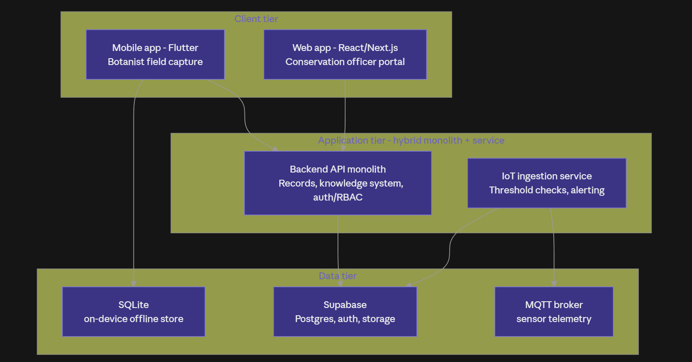
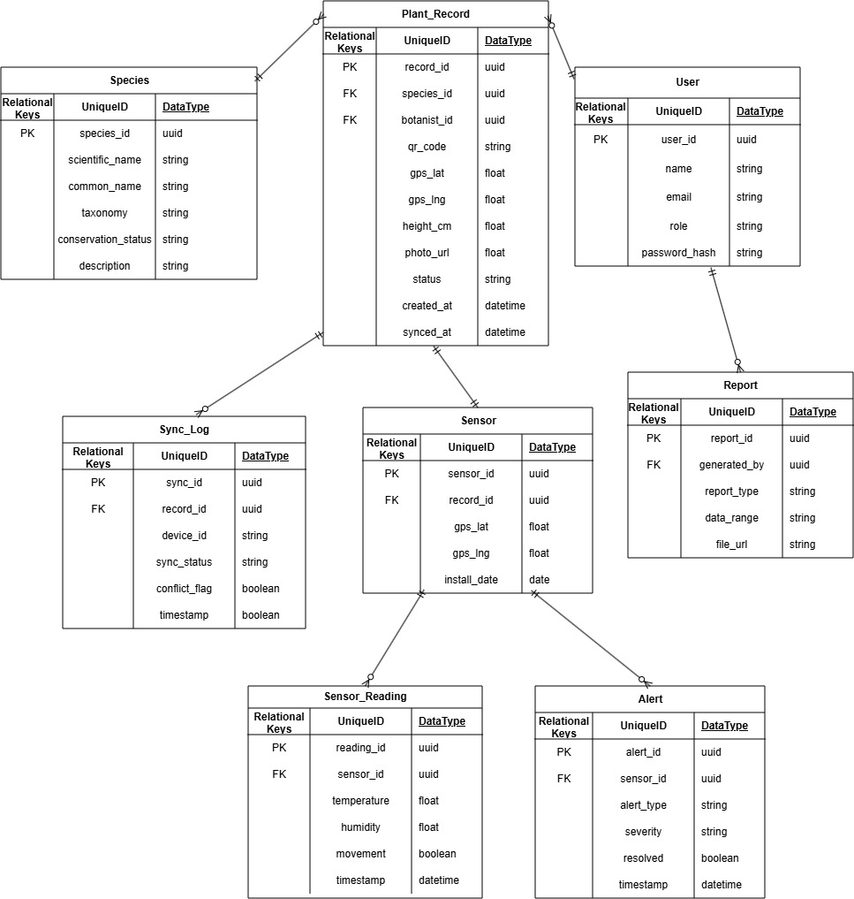
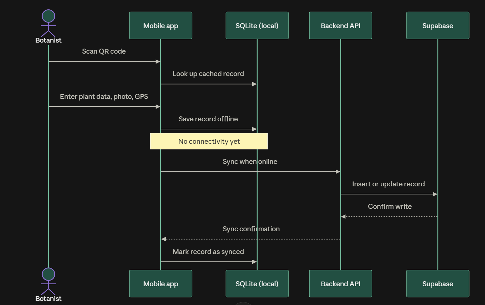
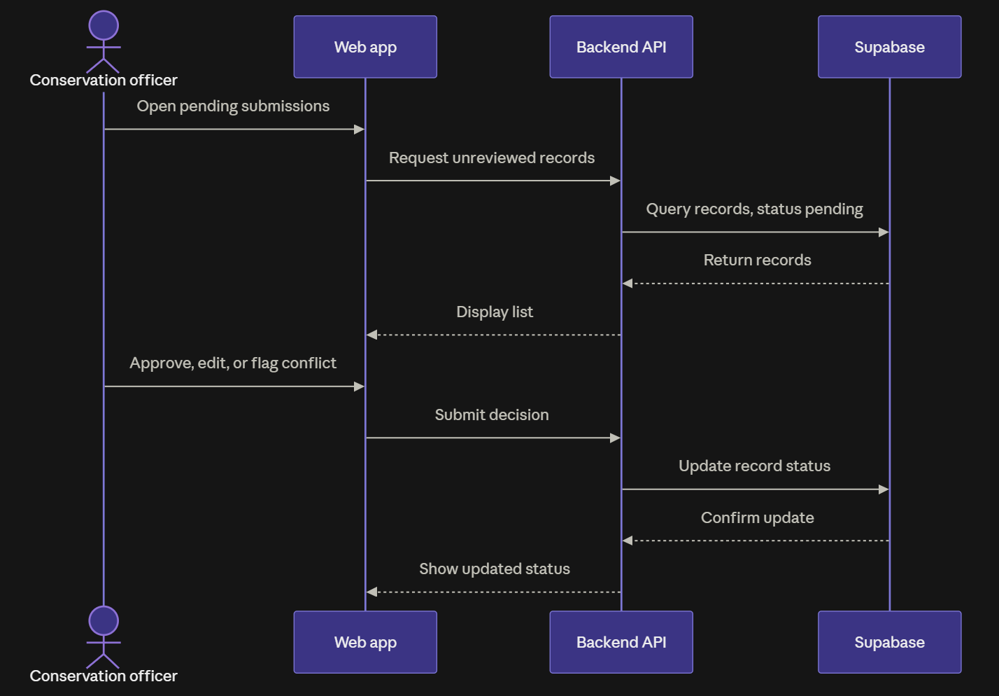
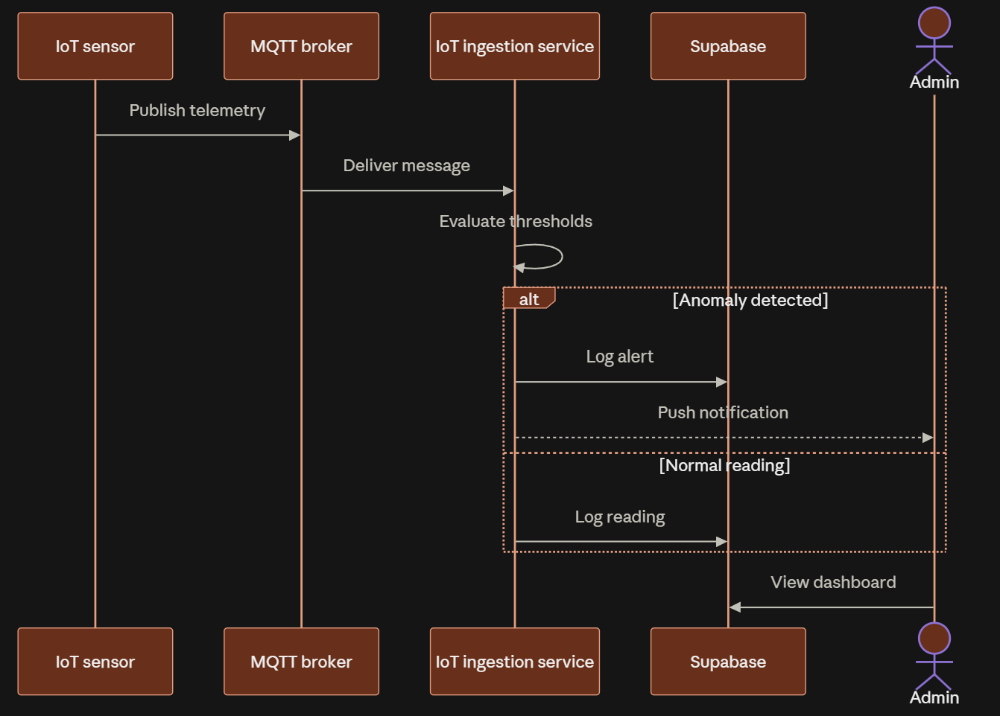

<p align="center">
  
</p>

<h1 align="center">Plantiful</h1>

<p align="center">
  <strong>Smart Ground-Truthing and Digital Biodiversity System for Plant Species Documentation</strong><br/>
  Niah National Park, Sarawak
</p>

---

## Overview

Plantiful is an integrated mobile and web platform that streamlines biodiversity documentation for Sarawak Forestry Corporation (SFC) at Niah National Park. Botanists scan QR-tagged plants and record species data offline in the field, and conservation officers manage, review, and publish that data through a centralised web knowledge system. An IoT monitoring layer — currently a simulated sensor feed — records environmental conditions around monitored field sites and raises alerts that conservation officers review in the web dashboard.

**Industry partner:** NeuonAI (SFC's commercialisation partner)

## Team (COS30049 Group 7)

| Name | Student ID | Role |
|---|---|---|
| Nathan Sebastian Learmonth | 102782258 | Web Knowledge System (Records) |
| Badrul Aliff Aiman bin Badrulmunirzaki | 102778273 | Web Knowledge System (Reporting & Maps) |
| Muhammad Maqeel bin Muhammad Kahfi | 102782384 | Mobile App (Sync & Backend APIs) |
| Ashley Wallen Anak Winston | 105806559 | Integration, PM & Documentation |
| Basill Agas Anak Heatley Rogers | 102778888 | Team Lead, Mobile App (Field Data Capture) |
| Gae Jayden MWINE | 104393610 | IoT-Based Plant Protection (sensor data pipeline, alert/threat detection logic, monitoring dashboard) |

## Tech Stack

| Layer | Technology |
|---|---|
| Mobile | React Native (offline-first, QR, GPS, camera) |
| Web | React / Next.js + Tailwind |
| Backend & DB | Supabase (PostgreSQL, auth, storage, auto-generated APIs) |
| Offline storage | SQLite (on-device) |
| IoT | Python sensor simulator + threat-rule evaluator → Supabase (`sensors`, `sensor_readings`, `alerts`) → officer alert dashboard |
| Security testing | OWASP ZAP |
| Version control | Git + GitHub |
| Hosting | Vercel / Render + Supabase |

## System Architecture

<p align="center">
  
</p>

### ER Diagram

<p align="center">
  <br/>
  <em>ER diagram. Plantiful data model.</em>
</p>

### UML Sequence Diagrams

<p align="center">
  <br/>
  <strong>Botanist workflow</strong>
</p>

<p align="center">
  <br/>
  <strong>Conservation Officer workflow</strong>
</p>

<p align="center">
  <br/>
  <strong>Admin workflow</strong>
</p>

## Repository Structure

```
COS30049_InnovationProject_Plantiful/
├── mobile/                ← React Native / Expo app (offline field data capture)
│   └── src/app/           ← Expo Router screens (scan, capture, records, sync, profile)
├── web/                   ← Next.js web knowledge system for conservation officers
│   └── src/app/           ← App Router pages (explore, species, map, records, reports, alerts, profile)
├── backend/
│   └── supabase/
│       ├── migrations/    ← 001_schema.sql, per-feature migrations 002–008, and apply_project.sql (consolidated)
│       └── seed.sql       ← assigns officer/admin roles by email + sample species catalogue
├── iot/                   ← Python sensor simulator + threat-rule evaluator (writes alerts to Supabase)
├── Docs/
│   ├── Assets/            ← logo, diagrams, images
│   ├── Reports/           ← proposal, final report
│   └── Templates/         ← docx + md templates
├── .gitignore
└── README.md
```

## How to Run

### Prerequisites

- Node.js 20+ and npm
- The Expo Go app on a phone (Android or iOS), or an Android emulator
- A Supabase project (free tier is enough) with the Project URL and anon key

### 1. Configure environment

Create these two files (both are git-ignored) with the Supabase Project URL and anon key. These are only used on the client and are safe to expose. Values come from Supabase Dashboard > Project Settings > API.

`mobile/.env`:

```
EXPO_PUBLIC_SUPABASE_URL=https://<project-ref>.supabase.co
EXPO_PUBLIC_SUPABASE_ANON_KEY=<anon key>
# Optional, defaults to record-photos
EXPO_PUBLIC_SUPABASE_PHOTO_BUCKET=record-photos
```

`web/.env.local`:

```
NEXT_PUBLIC_SUPABASE_URL=https://<project-ref>.supabase.co
NEXT_PUBLIC_SUPABASE_ANON_KEY=<anon key>
```

### 2. Set up the backend (one time)

1. Create a project in Supabase.
2. Enable Supabase Auth with email/password.
3. Open Dashboard > SQL Editor and run `backend/supabase/migrations/001_schema.sql` first. Then run `apply_project.sql` from the same folder — it is a consolidated, idempotent script covering `002_rls.sql` through `008`: RLS policies and schema backfills, workflow triggers, photo visibility, the botanist approval gate, the private reports bucket, and storage-bucket creation. If you prefer the individual files, run `002`–`006` in order and then `007_reports_bucket_private.sql` and `008_species_knowledge_fields.sql` — these last two are already included in `apply_project.sql`, so skip them when using the consolidated script.
4. Run `backend/supabase/seed.sql` to assign officer and admin roles by email — edit its two `update` statements to your own addresses first — and to load the sample species catalogue.
5. Invite your own test users in Dashboard > Authentication > Users and tick "Email confirmed" (email confirmation is on).
6. Verify the setup with the scripts under `backend/scripts/`: `verify_public_write_block.sql` should show anonymous writes rejected and anonymous reads limited to approved and published data, and `verify_record_photo_write.sql` must report `PASS` on every line before the mobile Sync now button is used.

### 3. Run the web app

```
cd web
npm install
npm run dev
```

Open [http://localhost:3000](http://localhost:3000). Sign in with an officer or admin account to see all records, approve or reject pending ones, and open record details. Search species in the records page with the suggestion box.

### 4. Run the mobile app

```
cd mobile
npm install --legacy-peer-deps
npx expo start
```

Scan the QR code shown by Expo with Expo Go on your phone, or press `a` for an Android emulator. Then:

1. Sign in on the Profile tab with a botanist account.
2. Scan a plant QR tag on the Scan tab.
3. Use the flashlight toggle in dark environments.
4. Fill in the capture details (species, height, morphology, notes), take photos, and save.
5. Go to Sync and tap "Sync now" to push offline captures to the central database as submitted records.

### 5. Verify the full loop

- A record captured on mobile shows up as Pending on the web for an officer.
- An officer approves or rejects it. Approved records become visible to the public portal.
- Botanists can see their own records on the web (including pending ones) after the `apply_project.sql` policy is applied.

### 6. Run the IoT monitor (optional demo)

```
python iot/publisher.py --once
python iot/evaluate.py
```

The publisher registers simulated sensors and pushes synthetic readings; the evaluator applies threat rules and raises alerts. Officers review the output at `/alerts` in the web app. There is no physical hardware — details in [`iot/README.md`](iot/README.md).

### Checks

```
cd web && npm run lint && npm run build
cd mobile && npx tsc --noEmit && npx expo lint
```

## Docs

- [System Proposal Report](Docs/Reports/System_Proposal_Report.md)
- [Product Backlog Template](Docs/Templates/01_R_Product_Backlog_Template.md)
- [Project Proposal Template](Docs/Templates/COS30029 Complete Project_Proposal_Template.md)
